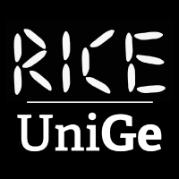

||<h1><a href="https://rice.dibris.unige.it/"> **H**olistic **O**perational **R**eality for **U**nified Systems </a></h1>|
|:-:|:-|

**Project Website:** https://rice-unige.github.io/horus/

---


## 📚 Table of Contents
- [📚 Table of Contents](#-table-of-contents)
- [🔍 Overview](#-overview)
  - [**Current Version:** `0.0.1`](#current-version-001)
- [🌟 Features](#-features)
- [🛠 Installation](#-installation)
- [🎮 Usage](#-usage)
  - [Prerequisites](#prerequisites)
  - [Setup](#setup)
  - [Using the HORUS Application](#using-the-horus-application)
- [🚧 Project Roadmap](#-project-roadmap)
  - [Year 1 (Current)](#year-1-current)
  - [Year 2](#year-2)
  - [Year 3](#year-3)
- [🤝 Contributing](#-contributing)
- [📝 License](#-license)
- [📖 Citation](#-citation)
- [📬 Contact](#-contact)
- [💡 Acknowledgments](#-acknowledgments)
  - [Developed by](#developed-by)
---

<a name="overview"></a>

## 🔍 Overview

HORUS (**Holistic Operational Reality for Unified Systems**) is an innovative Mixed Reality (MR) application developed for the Meta Quest 3 headset. It provides a comprehensive solution for managing teams of heterogeneous robots in various environments, particularly disaster scenarios.

### **Current Version:** `0.0.1`  
This initial release focuses on teleoperation capabilities for wheeled robots (**ROSbots**). Future updates will support heterogeneous robot teams, including legged (**Spot**) and aerial robots (**Airvolute** and **DJI Tello**).

---

<a name="features"></a>

## 🌟 Features

- 🥽 **Mixed reality interface** for robot control and team management.
- 🤖 **Multi-robot task allocation** and management.
- 📡 **Real-time sensor data visualization.**
- ✋ **Gesture-based controls** for intuitive robot interaction.
- 🚗 **Teleoperation Modes**:
  - Minimap (Ground Station) Mode
  - Semi-Immersive Mode
  - Full Immersion Mode
- 🎥 Flexible camera visualization.
- 🧑‍💻 **Optimized for Meta Quest 3 headset.**

---

<a name="installation"></a>

## 🛠 Installation

1. Download the latest APK from the [Releases](https://github.com/RICE-unige/horus/releases) section.
2. Install the APK on your Meta Quest 3 headset using SideQuest or your preferred method for sideloading apps.

> [!TIP]  
> Need help with sideloading? Check out the [Meta Support Documentation](https://www.meta.com/help).

---

<a name="usage"></a>

## 🎮 Usage

<a name="prerequisites"></a>
### Prerequisites
1. Install the **HORUS Bridge** application on your laptop, where the ROS master will be launched. Visit the [HORUS Bridge GitHub repository](https://github.com/Omotoye/horus_bridge) for installation instructions.
2. Ensure that both your laptop running HORUS Bridge and the Meta Quest 3 headset are on the same network.

<a name="setup"></a>
### Setup
1. Launch the **HORUS Bridge** on your laptop following the instructions in the HORUS Bridge README.
2. Set up and connect all robots for the interface. Instructions are provided in the [HORUS Bridge repository](https://github.com/Omotoye/horus_bridge).

<a name="using-the-horus-application"></a>
### Using the HORUS Application
1. Put on your **Meta Quest 3 headset**.
2. Navigate to your installed apps and launch HORUS.
3. Enter the IP address displayed in the **HORUS Bridge log** (on your laptop) into the HORUS application login page.
4. **Start Managing Robots**:
   - Draw a workspace in the MR environment to create a minimap.
   - Use the minimap to:
     - View robot status.
     - Visualize sensor data.
     - Allocate tasks.
     - Initiate teleoperation.
5. **Teleoperation Modes**:
   - 🗺 **Minimap Mode**: Navigate robots using a 2D overhead view.
   - 🎥 **Semi-Immersive Mode**: View robot camera feeds on a virtual large screen.
   - 🔍 **Full Immersion Mode**: Experience a direct video feed from the robot's front camera.

---

<a name="project-roadmap"></a>

## 🚧 Project Roadmap

### Year 1 (Current)  
- ✅ Develop core HORUS interface in Unity.  
- ✅ Implement teleoperation modes for wheeled robots.  
- ⬜ Complete multi-robot management for wheeled robots.  
- ⬜ Conduct initial user testing and refine the interface.  

### Year 2  
- ⬜ Extend support for legged (**Spot**) and aerial (**Airvolute**, **DJI Tello**) robots.  
- ⬜ Implement advanced trajectory planning and debugging tools.  
- ⬜ Develop multi-operator functionality.  
- ⬜ Integrate an AI copilot system for operator assistance.  

### Year 3  
- ⬜ Develop and implement collaborative strategies for heterogeneous robot teams.  
- ⬜ Conduct extensive experimental validation.  
- ⬜ Optimize the system based on experimental results.  
- ⬜ Open-source the HORUS application and release an SDK.  

---

<a name="contributing"></a>

## 🤝 Contributing

We welcome contributions to the HORUS project! Please read our [Contributing Guidelines](CONTRIBUTING.md) for more information on how to get started.

> [!NOTE]  
> Contributions can include new features, bug fixes, and documentation improvements.

---

<a name="license"></a>

## 📝 License

This project is licensed under the Apache License 2.0. See the [LICENSE](LICENSE) file for details.

---

<a name="citation"></a>

## 📖 Citation

If you use HORUS or ideas from this work in your research, please cite our paper:

- O. S. Adekoya, A. Sgorbissa, C. T. Recchiuto. [**HORUS: A Mixed Reality Interface for Managing Teams of Mobile Robots**](https://arxiv.org/abs/2506.02622). arXiv preprint arXiv:2506.02622, 2025.

  ```bibtex
  @misc{adekoya2025horus,
    title     = {HORUS: A Mixed Reality Interface for Managing Teams of Mobile Robots},
    author    = {Adekoya, Omotoye Shamsudeen and Sgorbissa, Antonio and Recchiuto, Carmine Tommaso},
    year      = {2025},
    eprint    = {2506.02622},
    archivePrefix = {arXiv},
    primaryClass = {cs.RO},
    url       = {https://github.com/RICE-unige/horus},
    pdf       = {https://arxiv.org/abs/2506.02622},
    note      = {arXiv preprint arXiv:2506.02622}
  }

<a name="contact"></a>

## 📬 Contact

For questions or support, please contact:
- **[Omotoye Shamsudeen Adekoya](https://rubrica.unige.it/personale/UkFEXVhg)**  
  -  Email: omotoye.adekoya@edu.unige.it  

---

<a name="acknowledgments"></a>

## 💡 Acknowledgments

This project is part of a PhD research at the **University of Genoa**, under the supervision of:  
- **[Prof. Carmine Recchiuto](https://rubrica.unige.it/personale/UkNDWV1r)**  
- **[Prof. Antonio Sgorbissa](https://rubrica.unige.it/personale/UkNHWlJp)**  

---

### Developed by  
[RICE Lab](https://rice.dibris.unige.it/)  at the [University of Genoa](https://unige.it/en)   
 
